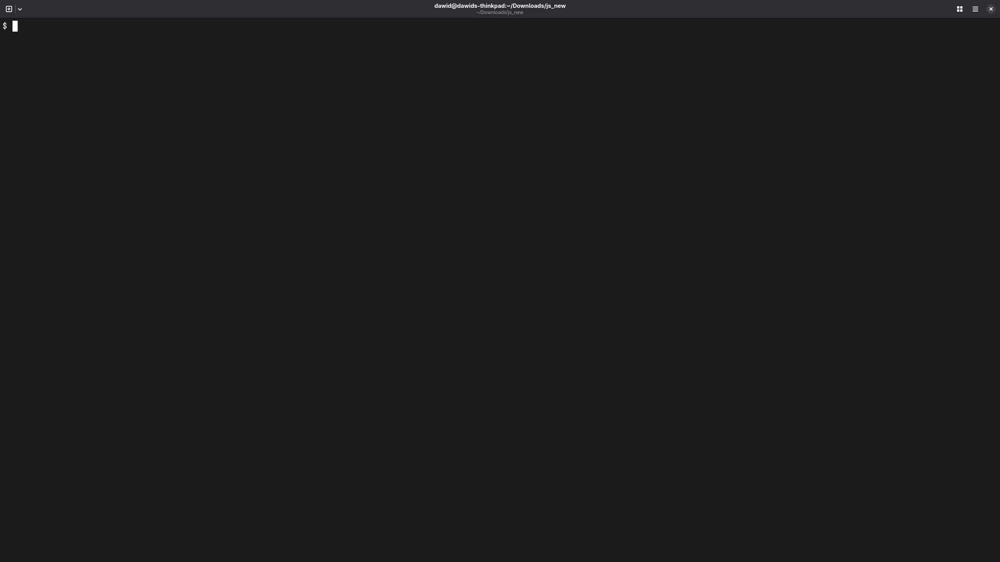

# Widevine CDM RCE (Firefox)
Since Google released a patched version and Firefox bumped the version, I can release this for everyone to see. 
This research has been ongoing for a while, but because of what I can only presume to be an AI-driven audit by the WV team, this has been patched before I could report it. Exploit primitives and ideas by me, exploit code by Claude (I **really** hate reading obfuscated code).

So - here is a working exploit that gets native code in the GMP sandbox in Firefox (~~batteries~~ sandbox escape not included).

Very unlikely to be abused in the wild since Widevine tends to be auto-updated by most modern browsers.

Tested on Ubuntu 26.04 and Fedora Linux 44.20260525.0 (Silverblue), on Firefox 151.0.2 and 151.0.1. 

**Offsets and such are for Widevine 4.10.2934.0, vulnerability fixed ~ 4.10.3050.0**

(I do not bundle a vulnerable version here since I do not have a distribution license)

## How it works

A heap buffer overflow when parsing SPSes from an H264 stream (`offset_for_ref_frame[]`). This field can hold 255 entries according to the spec, Widevine did not validate. Found almost instantly using a fuzzer, I can only imagine I'm not the first one that found this. We then pivot this overflow into a semi-arbitrary read to get everything we need for our ROP chain (and to aim it properly). One annoying caveat: there seem to be 2 heaps - a libc one from the "harness" and an internal one that looks like Google's `partition_alloc`. We do all of our work in `partition_alloc` which complicates things a bit since it loves its guard pages. But it's all good - we can achieve everything by overwriting adjacent SPSes, which are in the same slab.

Another interesting note: Firefox seems to fork the GMP, which means that between attempts the CDM base is the same. We could use this to our advantage, but we don't need to.

1. **Setup** — negotiate a Widevine MediaKeys session and forward the license
   request to a local proxy. No real decryption happens. This is simply a formality to get Firefox to allow us to communicate with the CDM.
2. **Leak** — overflow a live SPS's geometry fields. We change the stride to try to read the cdm and arena bases (used in stage 3).
3. **RIP** — the same SPS overflow rewrites a decoder context pointer to a
   picbuf where an I_PCM slice has planted a stack-pivot gadget. A trigger SPS
   fires an indirect call through that pointer, pivoting into a ROP chain that
   `mprotect`s the arena bitstream buffers and `jmp rsp`s into shellcode
   (`write(1,"PWNZ0RED\n",9); exit`).

Success is out-of-band: the shellcode prints `PWNZ0RED` on the GMP child's
stdout. The JS currently has no way to know if the exploit succeeded, so just watch the logs

## Running

1. Serve this directory over HTTP (e.g. `python3 -m http.server 8080`).
2. Start the license proxy: `python3 license_proxy.py` (listens on :8081).
3. Open `index.html` and press **RUN**. Wait for a message in the console! 
